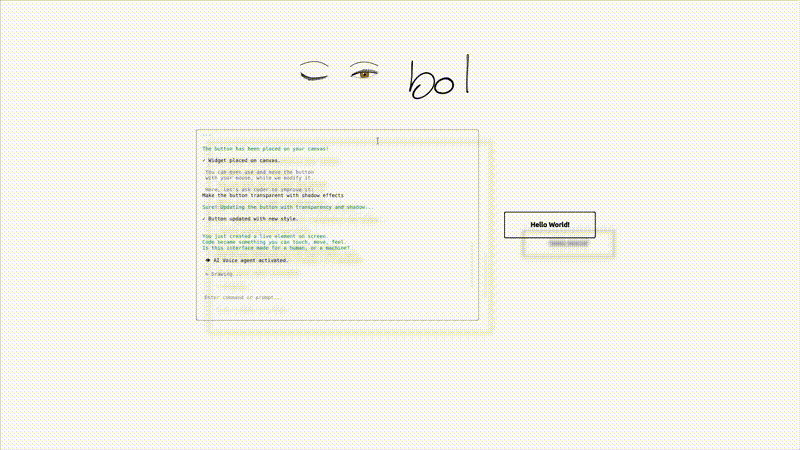
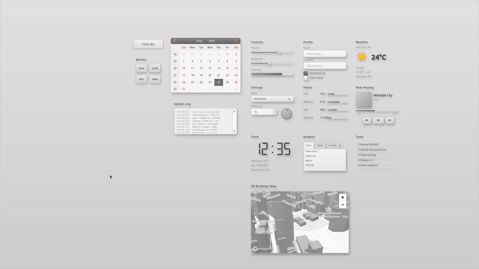

# Peribus

A Plan 9-inspired operating environment where LLM agents, a display server, and a multiplexer are exposed as a 9P filesystem. Everything is a file. One `cat` pipes an AI response into a scene parser. One `echo` rewrites reality.



## ⚠️ Caution — Read This First

**This software is experimental.** It gives LLM agents direct filesystem and shell access on every machine in the hive. There is now a token-based auth model (see below), but that only controls *who can mount the mux* — it does **not** sandbox what an authenticated agent can do once connected.

So two distinct risks remain:

- **Access control** — without tokens, anyone on the network can mount your mux and drive your agents. Configure auth tokens (`--auth-token`, `--auth-file`, or `RIOMUX_AUTH_TOKENS`) to gate this. Tokens are compared in constant time, but the 9P wire itself is unencrypted, so treat the network as part of your trust boundary.
- **Prompt safety** — even a fully authenticated agent has permission to write files and run commands. A careless or adversarial prompt can still wipe data or damage every machine it's routed to. Review what you ask agents to do, and keep nothing on these machines you can't afford to lose.

**Recommendation:** run with auth tokens enabled, on a private/isolated network, and stay deliberate about the prompts you send.

## Architecture

```
/n/                        ← mount root
├── llm/                   ← LLMFS: LLM agent filesystem
│   ├── claude/            ← agent instance
│   │   ├── input          ← write a prompt
│   │   ├── output         ← blocking read for response stream
│   │   ├── system         ← system prompt
│   │   ├── config         ← model, provider, temperature
│   │   └── ...
│   └── ctl                ← create/remove agents
├── rio/                   ← Rio: display server + scene graph
│   ├── scene/
│   │   ├── parse          ← write code/commands to execute
│   │   ├── CONTEXT        ← blocking read of executed code
│   │   └── screen         ← screenshot (PNG)
│   ├── version            ← undo/redo
│   └── ctl
└── ctl                    ← mux control (add/remove backends)
```

The **multiplexer** (riomux) stitches backends together at the 9P wire level. Mount remote machines and a single LLM request fans out across the hive.

## Quick Start

**Tested on:** Ubuntu (22.04/24.04) · **Python:** 3.11, 3.12, or 3.13

### Install (automatic — recommended)

From inside the cloned `peribus` directory:

```bash
./install.sh
```

This is self-contained and does everything: finds a compatible Python (3.11–3.13), creates a `.venv`, upgrades pip tooling, installs all the system (`apt`) prerequisites from `pre.txt` plus `fuse3` and `build-essential`, installs every Python dependency from `requirements.txt` (one at a time, so one bad package won't abort the run), and creates the `/n` mount point. No GUI bootstrap required.

When it finishes:

```bash
source .venv/bin/activate
python start.py
```

Then skip ahead to [First Steps](#first-steps).

### Install (manual)

Only needed if you'd rather not use `install.sh`.

```bash
# 1. System prerequisites (libfuse3-dev builds the pyfuse3 mount client;
#    portaudio19-dev must be present before pyaudio will build).
sudo apt install $(cat pre.txt) fuse3 build-essential
#    pre.txt contains: libminizip-dev libxcb-cursor0 portaudio19-dev libfuse3-dev
#    Install fuse3 only — the legacy `fuse` package conflicts with it on Ubuntu 22.04+.

# 2. Python dependencies
python3 -m venv .venv && source .venv/bin/activate
pip install --upgrade pip setuptools wheel
pip install -r requirements.txt

# 3. Mount point
sudo mkdir -p /n && sudo chown $USER /n
```

Then create a `.env` file at the project root with your API keys:

```
ANTHROPIC_API_KEY=sk-...
OPENAI_API_KEY=sk-...
GOOGLE_API_KEY=...
GROQ_API_KEY=gsk_...
CEREBRAS_API_KEY=...
CARTESIA_API_KEY=...
```

Launch:

```bash
python start.py
```

The start script walks you through mode selection: create a new mux, connect to an existing one, or run standalone.

### Mounting (no external 9pfuse needed)

Peribus ships its own FUSE client, `ninepfuse.py` (built on `pyfuse3`), so there's no separate `9pfuse` build step. `start.py` uses it automatically to mount the mux at `/n`, and it's the only client that supports authenticated mounts. The `pyfuse3` Python dependency and the `fuse3`/`libfuse3-dev` system packages above are all that's needed.

If you ever need to mount manually:
```bash
python ninepfuse.py 'tcp!127.0.0.1!5642' /n -t <token>
```

> **Why not the Linux kernel's v9fs?** You can `mount -t 9p` and it will connect, but v9fs does not support streaming reads. Peribus relies on blocking reads that stream data as it arrives (e.g. tailing an LLM response). With v9fs you'll get buffered chunks or EOF instead of a live stream, which breaks the core interaction model. Use the bundled `ninepfuse.py`.
>
> **Plan 9:** If you're running an actual Plan 9 machine, you can mount and operate the entire network natively — no FUSE needed. It's 9P all the way down.

## First Steps

1. **Onboarding** — On first launch, right-click to open the onboarding menu and follow the walkthrough.

2. **Set up `/coder`** — this is the main way in, on a single machine or across a whole hive. Open a terminal, then:

   ```
   /coder                          # set up the workspace-aware coding agent
   /provider claude                # pick a provider (claude, openai, openrouter, cerebras, ...)
   /model <model-name>             # pick a model on that provider
   ```

   The macro wires everything up automatically. Then just type your prompt — the agent writes to the scene and it renders on screen:

   > create a button and a calendar

   

   See `agent.py` for the agent model and `terminal_widget.py` for how macros configure it. To fan a single prompt out across multiple machines, see [Hive Mode](#multiplexer--hive-mode).

3. **Voice agents** — Right-click and scroll the widget to select between voice providers (Grok, Gemini, OpenAI). TTS/STT included.


## Terminal Commands

```
/coder [provider] [model]    Setup coding agent (recommended first command)
/new name [system]            Create + connect an agent
/connect <name>               Connect to existing agent
/master [provider] [model]    Spawn coordinating master agent
/av [voice]                   Grok voice agent
/av_gemini [voice]            Gemini voice agent
/attach <src> <dst>           Route one file to another (blocking, no polling)
/use <alias>                  Quick model switch (sonnet, opus, kimi, flash, ...)
```

See the full command reference in `terminal_widget.py`.

## Multiplexer — Hive Mode

Run Peribus across multiple machines on your LAN and a single request fans out across all of them.

1. **Install on each LAN machine** — run the install on every box you want in the hive.

2. **Launch each one** — start them with or without auth tokens (whatever you set at launch is what you'll pass to `/n/ctl`).

3. **Add the machines to the mux** — write to `/n/ctl`. The form is `add <name> <host>:<port>`, with an optional `:<token>` suffix when a backend was started with auth:

   ```bash
   # No auth
   echo 'add workstation2 192.168.1.50:5641' > /n/ctl

   # With a token (colon form)
   echo 'add workstation2 192.168.1.50:5641:token' > /n/ctl
   echo 'add workstation3 192.168.1.51:5641:token' > /n/ctl
   ```

4. **Set up `/coder` as usual** — the same flow as [First Steps](#first-steps). The macro auto-connects every backend you added and compacts the system context across the hive; machines are routed automatically.

5. **Write a prompt** — now you can target individual machines by name, and the scene renders on every screen:

   > create a button on workstation2, a calendar on workstation3

   Each piece is built on its target machine, and the result appears on all screens.

## The 9P Filesystem

The 9P filesystem is the core of everything. All state is files. All control is reads and writes. Example:

```bash
# Send a prompt and stream the response into the scene parser
echo "draw a red cube" > /n/llm/claude/input
cat /n/llm/claude/output > /n/rio/scene/parse
```

Blocking read semantics are preserved through the mux — `cat` blocks until content is ready, just like Plan 9.

## License

Apache License 2.0 — Copyright 2025–2026 Peripheria. See [LICENSE](LICENSE) for details.